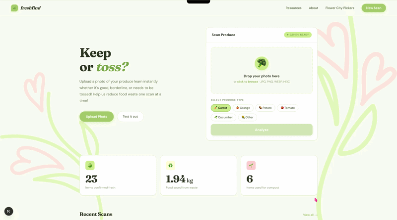

# 🌿 freshfind  

freshfind is an AI-assisted produce scanner designed to help users decide whether to **keep**, **use soon**, or **toss** their fruits and vegetables.  

By combining image uploads with AI classification through Gemini, FreshFind promotes smarter food decisions and helps reduce everyday household food waste. 
We built freshfind after volunteering with Flower City Pickers, a Rochester-based organization that recovers and redistributes produce from the City of Rochester Public Market.

freshfind is our answer. Whether you're a volunteer sorting donations, a student clearing out your fridge, or someone trying to stretch your groceries further, freshfind helps you stay informed about your food and reduce the waste that ends up in landfills every day.
---

## Features  

❀ Upload produce photos for instant AI analysis  
❀ AI-powered freshness classification (Google Gemini)  
❀ Confidence scoring for transparency  
❀ AI-generated analysis & usage suggestions  
❀ Real-time statistics dashboard  
❀ Scan history with detailed breakdown  
❀ Environmental impact tracking (kg of food saved)  
❀ Supabase-powered storage and database  
❀ Modal navigation between scans  

---

## Tech Stack  

### Frontend  
❀ Next.js 15 (App Router)  
❀ React  
❀ TypeScript  
❀ Custom CSS  

### Backend  
❀ Next.js API Routes  
❀ Supabase (Postgres + Storage)  
❀ Google Gemini API  

---

## Installation  

```bash
git clone https://github.com/akneewhowah/ramnhackathon.git
cd ramnhackathon
npm install
npm run dev
```

Then visit:

```
http://localhost:3000
```

---

## Why This Matters  

Food waste is one of the largest contributors to greenhouse gas emissions.  
FreshFind empowers individuals to make smarter food decisions and visualize their environmental impact through actionable data and AI-powered insights.

---

## 🎥 Demo



---

## Authors  

Built by:  
Renny Lin  
Niamh Cotter  
Anny Hua  
Michele Huang  

---
gi